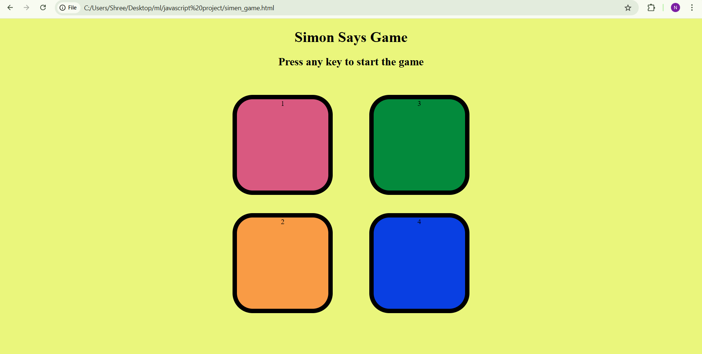
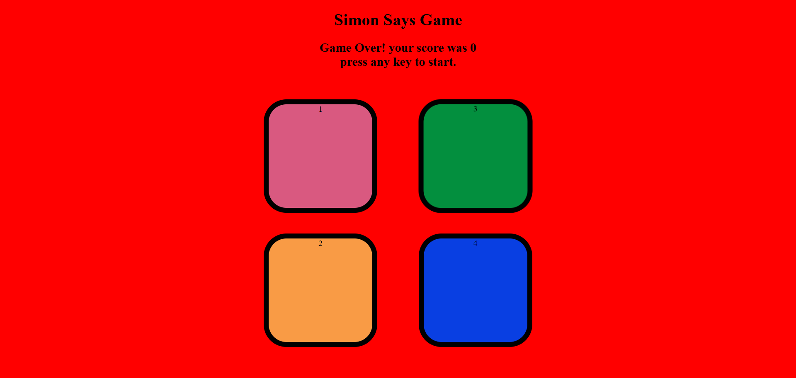

# 🎮 Simon Game

---

## 📌 Description

**Simon Game** is a fun and interactive memory-based game where players must observe and remember a sequence of colors and repeat them in the correct order.  
With every successful round, the sequence becomes longer, increasing the difficulty and improving memory skills.

---

## 🕹️ How to Play

- Click the **START** button to begin the game.
- Observe the sequence shown by the game.
- Repeat the sequence by clicking the tiles in the **same order**.
- Each correct attempt advances the game to the **next level**.
- The game continues until a **wrong input** is given.

---

## 📜 Rules and Regulations

- Players must follow the **exact sequence** shown.
- Inputs must be in the **correct order**.
- Skipping or changing the sequence is **not allowed**.
- Only **one attempt** is allowed per level.
- The game progresses **only after successful completion** of a level.

---

## ❌ Fail Conditions

The game ends when:

- The player clicks an **incorrect tile**.
- The input sequence **does not match** the generated pattern.
- The game is **refreshed or interrupted** during a round.

After failure:

- A **Game Over** message appears.
- The player can restart the game by clicking **START**.

---

## 🖼️ Snapshots

### 🔹 Home Screen
 
### 🔹 Game Screen
  

### 🔹 Game Over Screen
  

---

## 🛠️ Technologies Used

- **HTML**
- **CSS**
- **JavaScript**

---

## 🚀 Future Enhancements

- Sound effects
- Difficulty levels
- High score tracking
- Mobile responsiveness

---

## 👩‍💻 Author

**Nisha Sanap**

